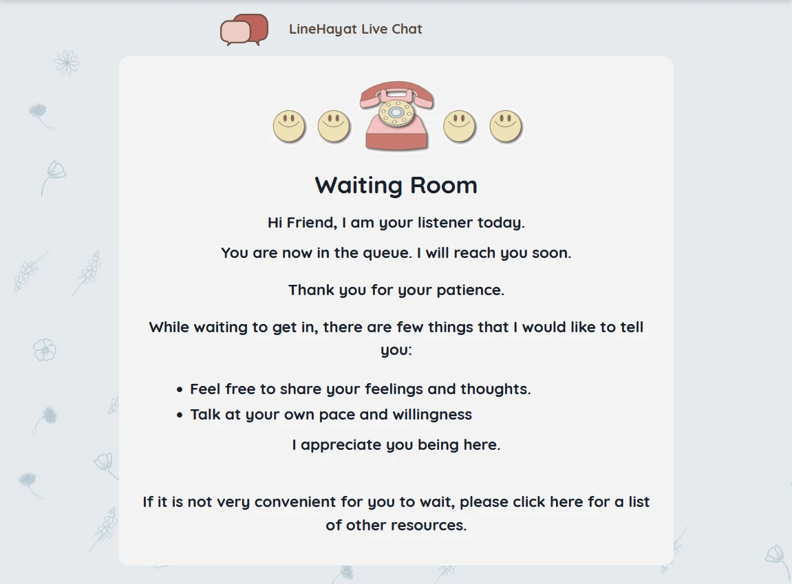
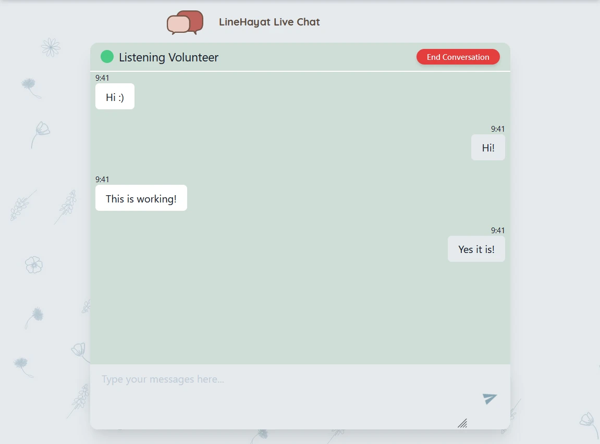
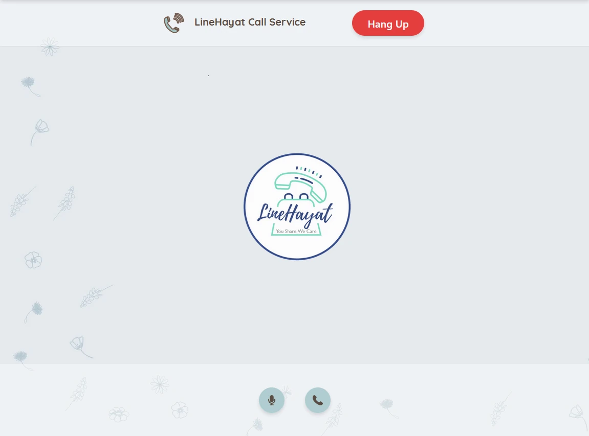

# Student guide

The functionality available on the student website includes:

* Requesting anonymous chat with a volunteer
* Requesting anonymous voice call with a volunteer

## Anonymous chat

To request an anonymous chat, follow these steps:

1. Navigate to [linehayat.netlify.app](https://linehayat.netlify.app)

2. Click on the **Chat** button

3. Go through the dialogue

4. When you arrive at the following screen, wait until a volunteer accepts your request

5. Once your request has been accepted, you will be redirected to the chat page

This is where you can chat with a volunteer. You can click the **End Conversation** button to stop chatting.

### FAQ

**What if I get disconnected while chatting?**

If you suddenly get disconnected, you will still be connected to the same volunteer until the volunteer ends the conversation.

**What if the volunteer disconnects while chatting?**

If the volunteer disconnects, you can end the conversation, in which case the volunteer will be informed; or you can wait until the volunteer has reconnected to keep chatting with them.

**How is chat data stored?**

Chat data is stored in browser storage (in a similar way to cookies), which may be local storage, session storage or IndexedDB, depending on the technologies that your browser supports. The chat data is cleared once the conversation ends.

**What happens to chat messages sent while either I or the volunteer were disconnected?**

You will receive the messages when you reconnect, if the conversation hasn't ended.

## Anonymous voice call

To request an anonymous voice call, follow these steps:

1. Navigate to [linehayat.netlify.app](https://linehayat.netlify.app)

2. Click on the **Call** button

3. Go through the dialogue

4. When you arrive at the waiting room, wait until a volunteer accepts your request

5. Once your request has been accepted, you will be redirected to the call page

This is where you can begin the voice call with a volunteer. You can click the **End Conversation** button to hang up.

You can use the two buttons to mute and unmute.

**Red** means the audio is muted.

**Green** means the audio is not muted.

**Microphone** is your own audio. Muting the microphone will cause the volunteer not to be able to hear you.

**Phone** is their audio. Muting the phone will cause you not to be able to hear the volunteer.

### FAQ

**What if either you or the volunteer get disconnected?**

The call will end, there is no reconnect functionality for voice calls.