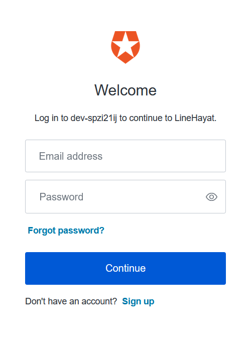
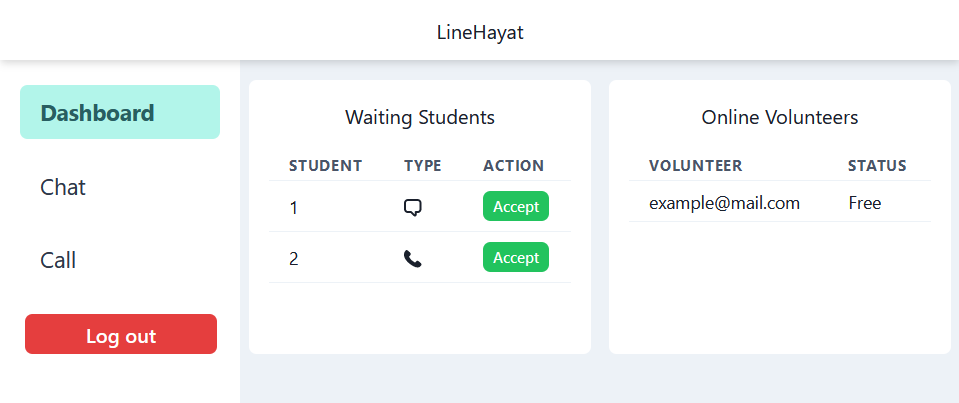

# Volunteer guide

Volunteers can use the LineHayat call and chat system to receive call and chat requests from students.

The functionality available on the volunteer website includes:

* Receiving anonymous chat and call requests
* Monitoring which volunteers are online and their status (Busy or Free)

## Volunteer login

To log into the LineHayat call and chat system as a volunteer, follow these steps:

1. Navigate to [linehayat-volunteer.vercel.app](https://linehayat-volunteer.vercel.app)

If you're not logged in already, you should arrive at this login screen:

2. Enter your user details and click **Continue**

## Accepting chat and call requests

When students request a call or chat and arrive at the waiting screen, they will show up on the dashboard.

You can click on the **Accept** button to accept their call or chat.

**Type** describes the type of request; a speech box icon means that it is a request to chat and a phone icon means that it is a request to call.

**Note that if the volunteer is already chatting with someone, the accept buttons will be disabled**

The call and chat functionalities are the same as for students, along with the ones handling disconnection. Please refer to the [student guide](student-guide.md) for more information.